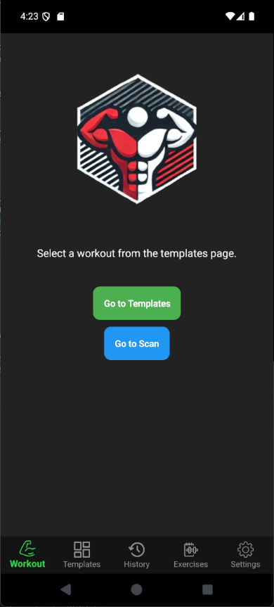
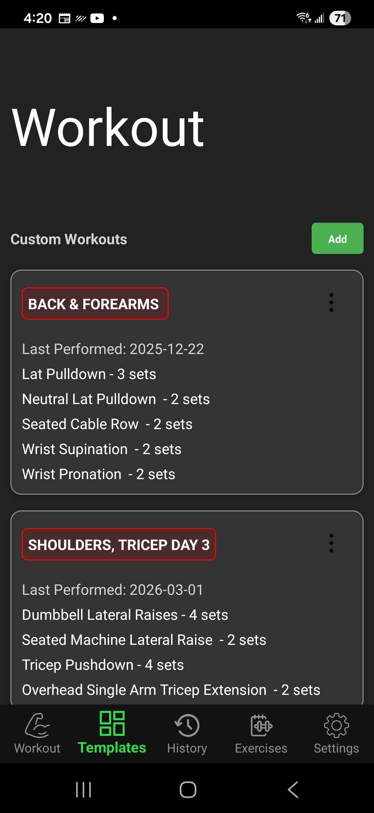
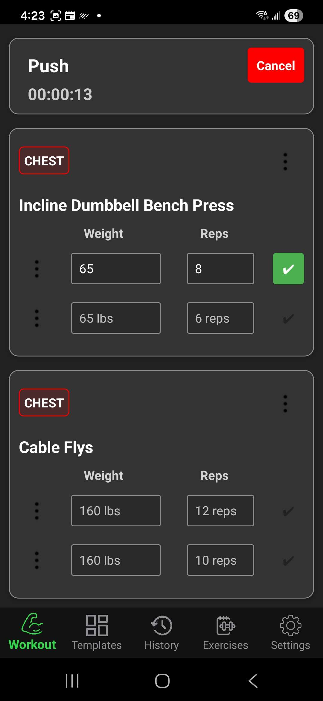
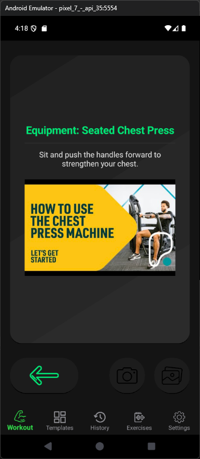
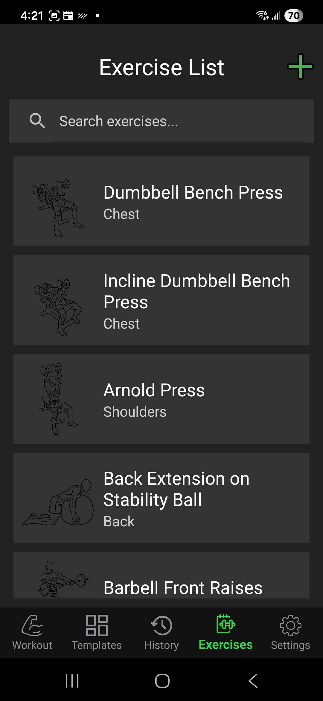
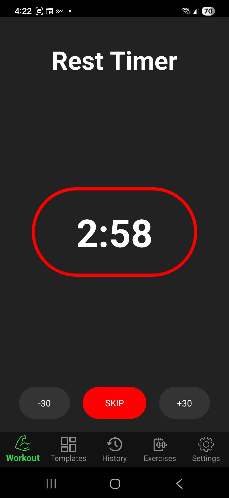
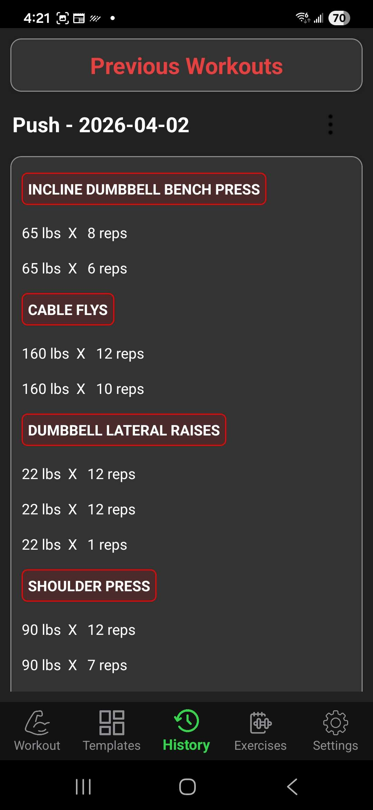

# HexaFit – Workout Tracking App

## Preview

  
  
  
  

   
   
   

---

## What is HexaFit?

Hexafit is a personal project of mine I built during summer time at my studies, it's meant to be a realiable free workout app. While the play/app store is litered with thousands of gym apps,
they all have a caveat. Weather it being a limited amount of workout templates (looking at you myfitnesspal), massive amount of bloat, or being paid. Hexafit was designed to be bloat free, simple
UI design and complelty free. I've personally been using this app for over 3 years after building it and never needed to switch.

---

## Features

-  **Workout Templates**
  - Choose from saved workouts
  - Create your own routines

-  **Track Your Sets**
  - Log reps, weight, and sets during workouts
  - Clean, distraction-free interface

- **AI Machine Identification**
  - Upload a picture of a gym machine
  - Get a YouTube video showing how to use it
  
-  **Progress Tracking**
  - Automatically remembers your last workout reps & sets
  - Helps you progressively overload
  - Built in workout counter

-  **Local Storage**
  - Everything is saved on your device
  - No login or internet required

-  **Smart Cancel**
  - Prevents you from accidentally losing a workout

---

## Author

**Justin Kadyrov**  
Software Developer & Fitness Enthusiast
